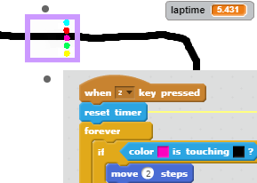
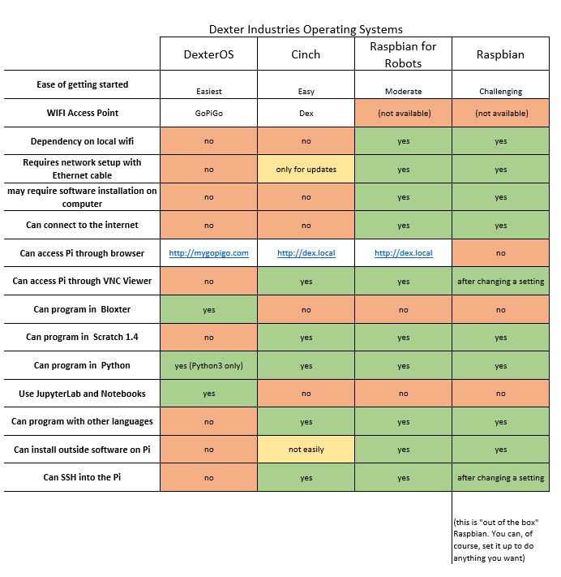
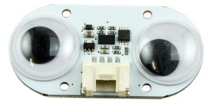
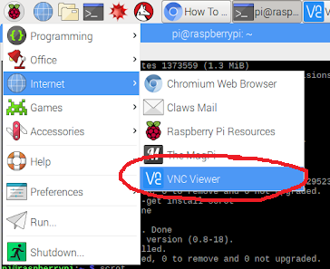
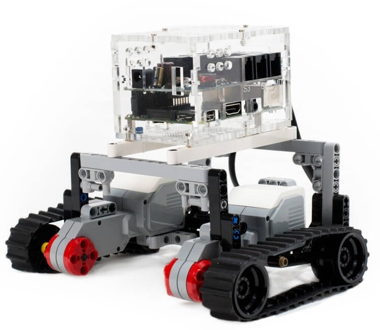
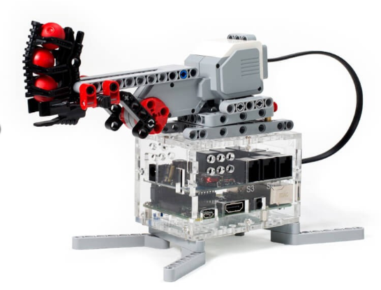
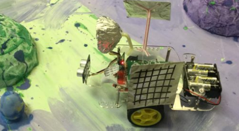
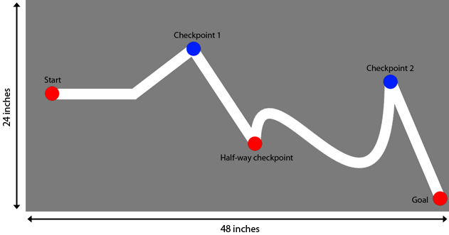

The Robots are coming
=====================

<iframe width="560" height="315" src="https://www.youtube.com/embed/fRj34o4hN4I" frameborder="0" allow="autoplay; encrypted-media" allowfullscreen></iframe>

[More Boston Dynamics Videos](https://www.youtube.com/user/BostonDynamics)

Discuss these questions in pairs.

1. What is a Robot?
2. What is AI?
3. Is a Chat Bot a Robot? ([here is an example](https://scratch.mit.edu/projects/120584554/))
4. Should we be scared of Robots?
5. What are a robot's Inputs?
6. What are a robot's Outputs?

--------------
Virtual Robots
==============

- [Coderz](http://play.gocoderz.com/login/#/login/)
- Get the password from your teacher

Virtual Line Follower in Scratch
================================
- [Link](https://scratch.mit.edu/projects/235284921)

------------
Build GoPiGo
============

Build [instructions on the Dexter Industries site](https://www.dexterindustries.com/GoPiGo/get-started-with-the-gopigo3-raspberry-pi-robot/1-assemble-gopigo3/).  If this links is broken just Search for the instructions page.

Careful:

- GoPiGo3 instruction not GoPiGo
- Loosing Bits
- Breaking Bits - don't force things - if you aren't sure, ask
- Static Electricity

------------------
Login to Dexter OS
==================

The simplest way of using GoPiGo is using Dexter OS. This is how you use it.

- Wifi SSID = GoPiGo (this is dangerous if many robots have the same name)
- type dex.local or mygopigo.com into the browser
- Rename your Robot (File > Rename Computer)
- Wifi SSID will now be ``<RobotName``>

DexterOS has no local login, no ssh or vnc connectvity. If you want to use these tools, you will need "Raspian for Robots".

###Advanced 
These are all the OSs (Operating Systems) you can use on your GoPiGo3 SD Card

---------------
Distance Sensor
===============

##[Assembly Instructions](https://www.dexterindustries.com/GoPiGo/get-started-with-the-gopigo3-raspberry-pi-robot/4-attach-the-camera-and-distance-sensor-to-the-raspberry-pi-robot/)

###Problems / Tasks

1. Stop In front of a wall
2. Stop and go round a wall
3. Stop turn and find the end of the wall
4. Go into either side of the Footwell and come out the other

-----
Servo
=====

A servo is a special motor (output device) that turns very slowly and it knows the angle of rotation so it can:

- be a hand on a clock
- turn a camera to a certain direction
- elevate a satellite dish to a certain elevation (angle)

##Assembly Instructions

[GoPiGo3 Servo](https://www.dexterindustries.com/GoPiGo/get-started-with-the-gopigo3-raspberry-pi-robot/6-attach-the-servo-kit-gopigo3-raspberry-pi-robot/)

--------------------
Combining Components
====================

Here are some suggestions to try. Come up with your own ideas:

- Servo with Distance Sensor - to look for exit from maze
- Servo with Camera - to film in all directions
- Servo with Servo - rotate + elevate eg. to aim a rocket
- Servo with Light Sensor - to move towards the window
- Distance Sensor x 2 - to look for a gap in a wall

##[Video Streaming Instructions](https://www.dexterindustries.com/GoPiGo/projects/python-examples-for-the-raspberry-pi/browser-video-streaming-robot-gopigo3/)

-------------
Line Follower
=============

- [Virtual Line Follower in Scratch](https://scratch.mit.edu/projects/235284921) Practice without getting your hands dirty

##[Assembly Instructions](https://www.dexterindustries.com/GoPiGo/get-started-with-the-gopigo3-raspberry-pi-robot/7-assemble-and-program-the-line-follower-for-raspberry-pi/)

##Configure

- In DexterOS click Learn > Line Following
- Read the instructions
- Calibrate for White THEN Calibrate for Black
- Write your program using Blockster Advanced

##Course building
- Use 2cm (3/4") Black Tape
- Five sensors have combinations eg. "wwbww" or "wbbww" or "bbwww"
- Finish course with a T-junction. Robot will stop with "bbbbb".
- Get the robot to turn round at the end and follow the line back.
- Can you manage a fork?

[More help](https://www.dexterindustries.com/GoPiGo/get-started-with-the-gopigo3-raspberry-pi-robot/7-assemble-and-program-the-line-follower-for-raspberry-pi/)

------------
Lego BrickPi
============

BrickPi3 allows you to control Lego Sensors and motors. Breathe new life into older NXT and EV3 Lego Kits. [Click here for project instructions from Lego](http://www.nxtprograms.com/projects.html)

##[Assembly & Instructions](https://www.dexterindustries.com/brickpi3-tutorials-documentation/)
You will need
- A VNC client to run scratch (see image below)
- Enable VNC on the server

    //On the Server
    sudo raspi-config
    networks > Enable VNC

Notice they haven't put the cables on yet!

Ball Sorter
===========

-------------------
Balance Bot GoPiGo
===================

You will need to rebuild your GoPiGo to get the wheels at the bottom. [Instructions](https://www.dexterindustries.com/GoPiGo/get-started-with-the-gopigo3-raspberry-pi-robot/assemble-gopigo3-balancebot/running-gopigo3-balancebot/)
You will need:
- IMU Sensor for Balance (Inertial Measurement Unit)
- IR Sensor and Sender for Remote Control (forward, backward, turn)
- A python script to do the balancing 

Lego and BrickPi
================
You can also do a balance bot with Lego and BrickPi

-------
GrovePi
=======

- [Tutorials and Documentation](https://www.dexterindustries.com/grovepi-tutorials-documentation/)
- [Weather Station](https://www.dexterindustries.com/projects/home-weather-display/)
- [Custom Minecraft Controller](https://www.dexterindustries.com/projects/custom-minecraft-controller/)

----
Notes  
====

- [Jupyter](https://www.youtube.com/watch?v=jZ952vChhuI)
- [Hackster.io Projects](https://www.hackster.io/dexter-industries/products/gopigo-robot-base-kit)
- Which SD card?

Issues
====

- Raspberry Pi clients need Firefox esr (but see Secondary@jis issue) SOLVED: Stretch upgrade has Chromium which works ok with Jupyter
- Raspberry Pi clients are not updating on Secondary@jis (use visitor@jis with pswd) SOLVED: if you install the Certificate
- Multiple Robots on DexterOS mean clashing ssids (Change Robot Name in DexOS > File > Change Robot name

Pimp My Bot
===========

##The Real Mars Rover

Colour Stations
===============
- Detect a coloured match on the floor
- Do different tasks at different stations 
- A good extension to line following
- But how will you mount your colour sensor?

Robots Meeting
==============
How can 2 robots communicate:
- using Sound?
- using IR?
Explore the basics of communication at a (short) distance

Worm Simulation
===============
Simulate a worm brain. The much studied C Elgans has 302 Nurons and 95 muscles. You will need
- Distance sensor
- Python script needs to be downloaded from github
- [Instructions](https://www.dexterindustries.com/GoPiGo/projects/python-examples-for-the-raspberry-pi/simulate-a-worm-brain/)

The Martian (Film Scene)
========================

Program the Pointer ... Point with
- The Robot
- The Servo - although our servos only turn through 180 degrees
<iframe width="560" height="315" src="https://www.youtube.com/embed/ffB0Je-xjKg" frameborder="0" allow="autoplay; encrypted-media" allowfullscreen></iframe>

Facial Emotion Recognition
==========================
Let [Empathy Bot](https://www.dexterindustries.com/projects/raspberry-pi-robot-that-reads-emotions/) read your emotions using Google Cloud Vision API for the Artificial Intelligence

<iframe width="560" height="315" src="https://www.youtube.com/embed/izj8hpqGHy8" frameborder="0" allow="autoplay; encrypted-media" allowfullscreen></iframe>

Phone Remote
============
Android doesn't seem to want to let you get into gopigo3...