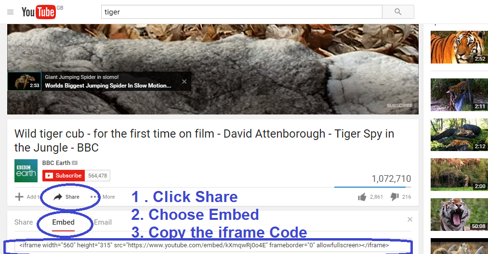
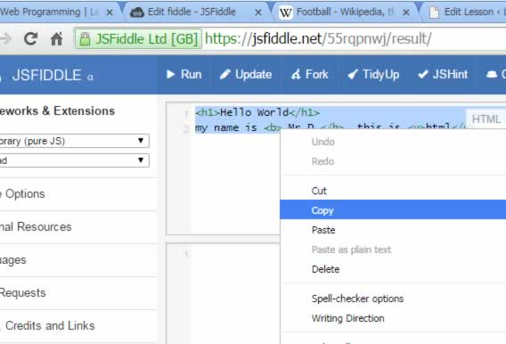
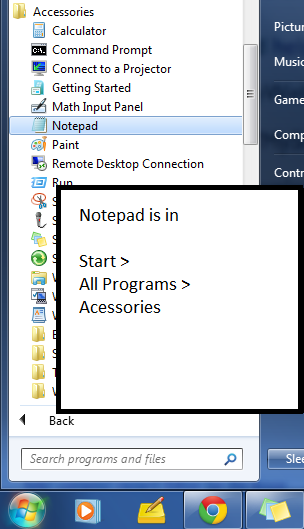

# Lesson 1: HTML Basics

- HTML is the language of the web.
- HTML = Hypertext Markup Language

### Lets get started!

---

# Safety First

In this lesson you will actually be working on the public internet so remember:

- First names only
- Don't use personal information that could be used to identify you or your friends
- Don't write anything you wouldn't want your teachers or parents to see

---

# Getting Started

1. Open up [JSfiddle.net](http://jsfiddle.net)
2. write the text below in the top left corner (the html window)

   > Hello World !

3. press run and watch your website appear on the bottom right
4. Add the following

   > This is a website about me `<b>Billy</b>` written in html.

(use your first names only - to be web safe)

#### What does the `<b>` tag do?

#### What does the `</b>` tag do?

alternative online editors

- [Code Pen](http://codepen.io/pen/)
- [JSBin.com](http://jsbin.com)

---

# HTML Tag Pairs

```html
<b> starts or opens the bold text
</b> stops or closes the bold text
```

#### What happens if you miss the closing tag `</b>` ?

---

# More Tag Pairs

Investigate what these tags do  
(don't forget closing tags starting with `</`

```html
<u>
<i>

<h1>
<h2>
<h6>
<h7>

<li>    This is special it doesn't need closing
<br>    This is special it doesn't need closing
```

#### Which of these tag pairs **does NOT** force a new line to be created?

These are called *inline* tags. Tags that put the content on a new line are called *block* tags

---

# Headings

Use headings to make your website easier to read.

```html
<h1>Hello World</h1>
This is a website all about me Billy, written in html

<h2>Favourite Food</h2>
I love chocolate

<h2>Favourite Sports</h2>
I love motor racing
```

You also need to keep your html neat to make it easier for you and other coders to read.

---

# Lists

You looked at the `<li>` list tag. Try adding the `<ol>` tag pair around the list items

```html
<ul>
  <li>Bread
  <li>Milk
  <li>Eggs
</ul>
```

#### What happens if you change `<ul>` to `<ol>`?

#### Find out what `ol` and `ul` are short for

- [More info](http://www.w3schools.com/tags/tag_ol.asp)

---

# Links

Links are made by using `a` tags or 'anchors'. I don't think that `anchor` is an easy name for a link but you will soon remember it

```html
<a>this is a link</a> to a Website.
```

The `a` tags won't work yet, you need to add the website to link to (using http://)

```html
<a href="http://wikipedia.com"> this is a link</a> to a Wikipedia.
```

#### the `href=""` is called an attribute. The `<a>` tag needs an `href` attribute to work.

### You could also try

- [More info](http://www.w3schools.com/tags/att_a_href.asp)
- [Decoded lesson on Links/Attributes](http://o2learn.decoded.co/html-css/lesson/3)

---

# Images

1. First you need to find an image on the web
2. Right click the image to find the address
3. Copy the address in between the `"` double quote characters

   > ``

This tag doesn't need closing.

### Reduce the image size

```html

```

### Add Youtube Video

copy the iframe code into your html



## You could also try...

- [W3C Images](http://www.w3schools.com/html/html_images.asp)
- [Decoded Lesson on Images](http://o2learn.decoded.co/html-css/lesson/4)

#### I have managed to link an image onto my web page.

#### I have managed to link an image onto my web page.

---

# Copy & Save

From JSfiddle.net



## Instruction for saving in Notepad

- Copy your html into a text file using notepad (in Start> All Progs > Accessories)
- Create a folder called My Website
- Save the text file in this folder as Me.html
- Double click on your Me.html file in your My Website folder.



---

# Next

Use CSS to make your website pretty

[CSS Styling](css-style.html)

<!--
Legacy UI markers from the old Learnstones slideshow:
- each slide had a traffic-light control set
- server reporting is intentionally omitted for now
-->
