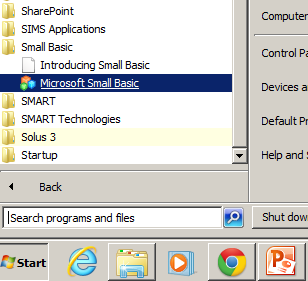

Getting Started
===============

You will need to open Small Basic

#History / Background

- Pong was the first commercially available Computer game released in November 1972 
- Pong was maybe copied from Electronic Tennis or Magnavox Odyssey's Tennis game
- Electronic Tennis was programmed some time in the early 1960's but never released as a product
- Magnavox Odyssey was the world's first ever video console - Released in August 1972

[Youtube link](https://www.youtube.com/watch?v=iPigmdzAbyk)

##In Cabinet Format

#Magnavox Odyssey (1972)
##World' First Video Console

---------------------
Graphics Window Setup
=====================

    GraphicsWindow.Show()

Then set up initial values for the x and y coordinates

    x = 0 
    y = 0 

    GraphicsWindow.DrawEllipse(x, y, 10, 10)

-------------
Move the ball
=============

Increment x (speed) within a loop to move the ball

    x = x + 5
    GraphicsWindow.DrawEllipse(x, y, 10, 10) ' Draw the ball again

###Extension (optional)

Use variable dx as the difference in the x coordinate between old and new position
    
    dx  = 5 ' Move the ball 5 pixels

    x = x + dx

What is the advantage of using dx?

-----------------
Add the main Loop
=================

We increment the x variable to increase it each time the loop is used

    While (x <300)
      x = x + 5

      GraphicsWindow.DrawEllipse(x, y, 10, 10)

    EndWhile

###Theory
There are 2 ways of looping in Small Basic, "While" loops and "For" Loops

[Small Basic Reference](http://social.technet.microsoft.com/wiki/contents/articles/16065.small-basic-getting-started-guide-chapter-5-loops.aspx)

--------------
Screen Refresh
===============

To give the idea of movement we need to 

- wait 
- clear the old ball before we draw the new one

.

    Program.Delay(100)
    GraphicsWindow.Clear()

------------------------
Bounce - "If" Statement
========================

When the ball gets to the edge of the screen we need it to bounce back

    If (x > 300) Then 
      dx = ' Write answer here
    EndIf

-----------
Y Up and Down
===========

Can you add up and down movement?

- Initialise the variable y 
- Increment y
- Bounce if it hits the bottom wall

------------
Score a Point
============

The loop could stop when the ball goes past the left edge of the screen. You will need to change the following line.

    While (x <300)

- Initialise (Create) a variable "Score" that starts at zero
- increment the score each time the ball passes to the left of the screen
- Print the score (see below).

.
    
    GraphicsWindow.DrawText(100,0, Score)

Then you can add an new loop to keep playing points until the score reaches 3

    While (Score < 3)
      '..Main Loop and some variable initialization goes here
    EndWhile

-------------------------
Controls - Event Handling
=========================

##Create The Bat

Use bat_y for the y coordinate for the bat

     GraphicsWindow.DrawLine(10,bat_y, 10, bat_y + 40)

This line will run the Sub "EventCheck"

    GraphicsWindow.KeyDown = EventCheck
    
Place this sub at the end of your code

    Sub EventCheck
      if GraphicsWindow.LastKey = "Z" Then 'Note this is a Capital Z
        bat_y = bat_y + 10
      EndIf 
    EndSub

---------------
Collision detection (Bat and Ball)
===============

You will need to have a number of conditions occuring at once. You need to nest your "if" statements as below:
 
      If (cond 1) Then
        If (cond 2) Then
          If (cond 3) Then
             'bounce
          Endif
        EndIf 
      EndIf

Or alternatively this might work

      If (cond 1) AND (cond 2) AND (cond 3)
          'bounce    
      EndIf

----------------
Finish the Game
===============

##Think about

- 1 or 2 Player?
- Tennis or Squash?
- Be able to direct the ball using different parts of the paddle
- Some random bounce using `Math.GetRandomNumber(10)`  
- Colour
- Instruction Screens
- Levels with faster speeds
- Variations eg. [2 way with gravity Pong](http://smallbasic.com/program/?MDJ923) (Needs IE with Silverlight installed)
- An alternative method using `Shapes.Move(ball, x, y)` where `ball = Shapes.AddEllipse(16, 16)` This avoids the need to do a screen refresh.