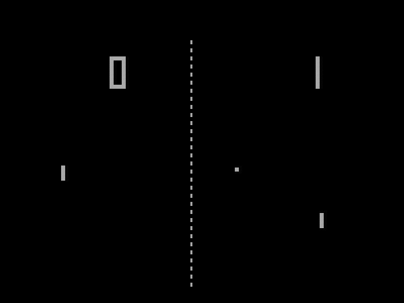
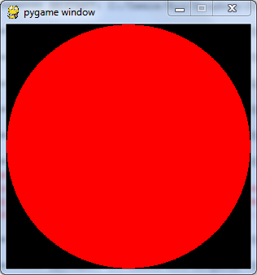
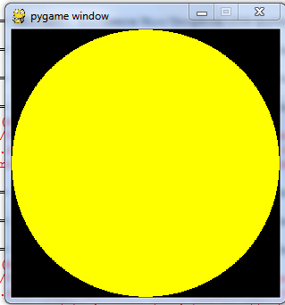
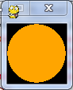
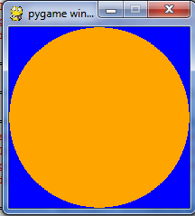
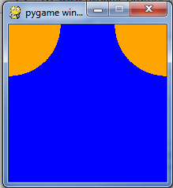
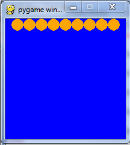

Getting Started
===============

You will need to have pygame installed. (JIS Rooms R0D and R1J only) 
Test by typing 'import pygame' into the idle prompt with no error

    >>>import pygame
    >>>>

If you get an error its not installed

History / Background
=====================

- Pong was the first commercially available Computer game released in November 1972 
- Pong was maybe copied from Electronic Tennis or Magnavox Odyssey's Tennis game
- Electronic Tennis was programmed some time in the early 1960's but never released as a product
- Magnavox Odyssey was the world's first ever video console - Released in August 1972

[Youtube link](https://www.youtube.com/watch?v=iPigmdzAbyk)

##In Cabinet Format

#Magnavox Odyssey (1972)
##World' First Video Console

---------------------
Pygame Setup
=====================

    # Note: if using MU run in Python3 mode not pygame zero mode
    import pygame
    screen = pygame.display.set_mode((300, 300))

    #set up initial values for the x and y coordinates
    x = 0 
    y = 0 
    radius = 10
    red = 255,0,0

    pygame.draw.circle(screen, red, (x,y),radius)  #puts the circle into the graphics memory
    pygame.display.update()                        #draws the circle on the screen
    
    #to ensure graceful exit
    anyinput = input("press enter to quit") #note the input must be in the python window - not pygame window
    pygame.quit()

---
Rect
====
Drawing a rectangle is a bit weird. As a rect object must be inside the draw statement. 

     pygame.draw.rect(screen, blue, pygame.Rect(0,0,rectwidth,rectheight) ) 

###Reference
[pygame.draw.rect(Surface, color, Rect, width=0) -> Rect](http://www.pygame.org/docs/ref/draw.html#pygame.draw.rect)

[pygame.Rect(left, top, width, height) -> Rect ](http://www.pygame.org/docs/ref/rect.html)

---
Drawing Practice
====
Produce code for the following images and copy and paste the answers into the boxes. 

- You should use variables for screen height and screen width. 
- Orange is red with more than a half green
- Think about the sequence of your instructions to get the circle on top of the background colour

1. 
300x300 
[input type="textarea" name="1-RedOnBlack300x300" cols=80 rows=6]

2. 
300x300 
[input type="textarea" name="2-YellowOnBlack300x300" cols=80 rows=6]

3. 
75x75
[input type="textarea" name="3-OrangeOnBlack75x75" cols=80 rows=6]

4. 
200x200
[input type="textarea" name="4-OrangeOnBlue200x200" cols=80 rows=6]

5. 
200x200
[input type="textarea" name="4-TwoOrangeOnBlue200x200" cols=80 rows=6]

6. 
200x200  How are you going to repeat all those circles?
[input type="textarea" name="6-TenOrangeOnBlue200x200" cols=80 rows=6]

-------------
Move the ball
=============

Increment x (speed) within a loop to move the ball

    x = x + 5
    pygame.draw.circle(screen, red, (x,y),radius)
    pygame.display.update()

###Extension (optional)

Use variable dx as the difference in the x coordinate between old and new position
    
    dx  = 5 # This stays outside the loop

    x = x + dx 

What is the advantage of using dx?

--------------
Screen Refresh
===============

To give the idea of movement we need to 

- draw the ball
- wait 
- clear the old ball before we draw the new one

###Waiting in python

    import time  #do this in the first line or 2 of your code
    
    time.sleep(0.01)  #asks the computer to wait

-----------------
Add the main Loop
=================

We increment the x variable to increase it each time the loop is used. Here is the psuedocode.
Notice the 5 steps inside the loop

    loop (forever)
        # 1. draw the circle
        # 2. update the screen
        # 3. wait a bit
        # 4. draw over the circle with background colour
        # 5. increment x to the new position
    endloop

###Real Games programming
There are better more efficient ways to move the ball, but this is the simplest.

------------------------
Bounce - "If" Statement
========================

When the ball gets to the edge of the screen we need it to bounce back

    if x > 300 then:
      dx = ??? # you need to think about this   

###Extension

use boolean OR to add the bounce to the left wall

OR in python must be in lower case ie `or`

-----------
Y Up and Down
===========

Can you add up and down movement?

- Initialise the variable y 
- Increment y
- Bounce if it hits the bottom wall (OR the top)

------------
Score a Point
============

The loop could stop when the ball goes past the left edge of the screen. You will need to change you bounce condition for scoring

- Initialise (Create) a variable "Score" that starts at zero
- increment the score each time the ball passes to the left of the screen
- Print the score (see below).

.
    
    GraphicsWindow.DrawText(100,0, Score)

Then you can add an new loop to keep playing points until the score reaches 3

    While (Score < 3)
      '..Main Loop and some variable initialization goes here
    EndWhile

-------------------------
Controls - Event Handling
=========================

##Create The Bat

Use a rectangle from the coordinate bat_y for the y coordinate for the bat. The bat can extend down 40 pixels

    import pygame
    import sys #This is needed for the sys.exit() which can stop pygame crashing on exit.
    #The following code must be included inside your main loop (at the bottom is best) 
 	  #be careful with your indentations!!
        for event in pygame.event.get():
            print(event) #optional - will print to the text window not the pygame window
            if event.type == pygame.KEYDOWN:
            #using Arrow keys
                if event.key == pygame.K_RIGHT:
                    dx = 1
                    dy = 0
                if event.key == pygame.K_LEFT:
                    dx = -1
                    dy = 0
                if event.key == pygame.K_UP:
                    dy = -1
                    dx = 0
                if event.key == pygame.K_DOWN:
                    dy = 1
                    dx = 0
                #using wasd keys (only partially completed)
                if event.key == pygame.K_d:
                    dx = 1
                    dy = 0
                if event.key == pygame.K_a:
                    dx = -1
                    dy = 0
            #or use the mouse 
            if event.type == pygame.MOUSEMOTION:
                (notused, y) = event.pos
                x = 0            
            if event.type == pygame.QUIT:   #
                pygame.quit()
                sys.exit()
            

---------------
Collision detection (Bat and Ball)
===============

You will need to have a number of conditions occuring at once. You need to nest your "if" statements as below:
 
      if (cond 1):
        if (cond 2): 
          if (cond 3):
             #bounce

Or alternatively this might work

      if (cond 1) or (cond 2) or (cond 3):
          #bounce    

----------------
Finish the Game
===============

##You could try

- 1 or 2 Player?
- Tennis or Squash?
- Be able to direct the ball using different parts of the paddle
- Some random bounce using `Math.GetRandomNumber(10)`  
- Colour
- Instruction Screens
- Levels with faster speeds
- Variations eg. [2 way with gravity Pong](http://smallbasic.com/program/?MDJ923) (Needs IE with Silverlight installed)
- An alternative method using `Shapes.Move(ball, x, y)` where `ball = Shapes.AddEllipse(16, 16)` This avoids the need to do a screen refresh.