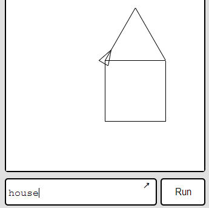
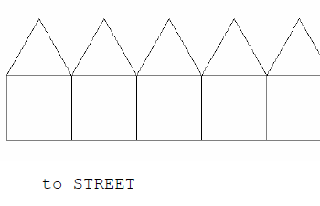
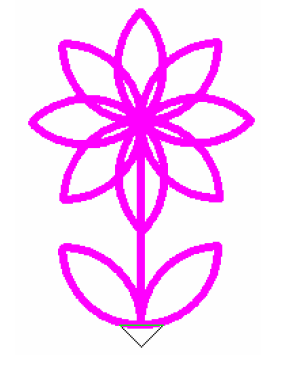
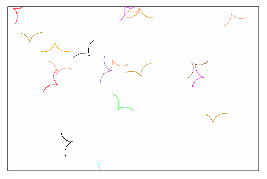
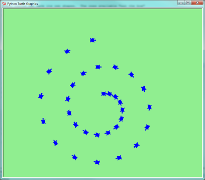

<h1>Getting Started</h1>
You can run Python in the browser or use a downloaded version. The Turtle is included as a module so you need to import it and then use the turtle object to create one or more turtles.
<h2>Initialise Turtle Module</h2>
<pre><code>import turtle
alex = turtle.Turtle()
</code></pre>
<h1><a href="https://trinket.io/library/trinkets/7d11225794">Open Python HERE</a></h1>
<h2>TASK</h2>
Complete a Square then a triangle
<h2>Python Turtle Documentation</h2>
<a href="https://docs.python.org/2/library/turtle.html">https://docs.python.org/2/library/turtle.html</a>

<h1>Looping</h1>
Use iteration or looping to save typing
<pre><code>for x in range(4):
  turtle.forward(100)    #use alex.forward(100) and bea.right(90) etc.
  turtle.right(90)
</code></pre>
<a href="https://trinket.io/library/trinkets/2d238d1d51">Loop Code</a>
Make alex do a pentagon and bea do an octagon
<ul>
	<li>[input name="shapes-using-repeat" size="40" ]  Pentagon using for loop</li>
	<li>[input name="shapes-using-repeat2" size="40" ]  Octagon using for loop</li>
</ul>
<h3>Extension</h3>
<ul>
	<li>[input name="formula-for-polygon" size="40" ]  Formula for the angle in an n-sided polygon</li>
</ul>
<h1>Python Documentation</h1>
<ul>
	<li><a href="https://wiki.python.org/moin/ForLoop">For Loops</a></li>
	<li><a href="https://docs.python.org/2/tutorial/controlflow.html">Control Flow</a></li>
</ul>

<h1>Define Functions</h1>
In Python Sub-routines are called functions

Which is easier to write and understand?
<pre><code>for x in range(4):
  turtle.forward(100)
  turtle.right(90)
</code></pre>
or
<pre><code>squ()    
</code></pre>
To create the subroutine called <code>squ</code> use the following (note the double indentation)
<pre><code>def squ():
  for x in range(4):
    turtle.forward(100)
    turtle.right(90)

squ()  #This is needed to make the sub "squ" run
</code></pre>
<h2>Theory</h2>
Subroutines, Functions or Proceedures are:
<ul>
	<li>Easier to Read and understand</li>
	<li>Allow us to re-use code</li>
</ul>
<h2>Task</h2>
<ul>
	<li>Create a sub for TRI (a triangle)</li>
	<li>Create at least 2 subs for other shapes we have made PENT, HEX, CIRC etc</li>
</ul>
Reference: <a href="http://www.tutorialspoint.com%2Fpython%2Fpython_functions.htm">Function Documentation</a>

<h1>Abstraction</h1>
<ul>
	<li>Abstraction means hiding the detail</li>
	<li>Used with Decomposition, and Pattern Recognition...</li>
	<li>it's a big part of <a style="line-height: 1.71429; font-size: 1rem;" href="https://en.wikipedia.org/wiki/Computational_thinking" target="_blank">Computational Thinking</a></li>
</ul>
&nbsp;
<h4>Task 1: Create a House using SQU and TRI</h4>

<h4>Task 2: (Harder) Create a street</h4>

<h3>Traffic Light Checkpoint</h3>
<ul>
	<li>I have done house and street</li>
	<li>I know that to find the problems in my code I have to 'debug' it (work like a detective)</li>
	<li>I know that programs are split into pieces which are combined together and this is called abstraction</li>
</ul>
<h3>Submit</h3>
Copy and paste all your code for STREET and/or HOUSE. You need to include all the subs eg. house, squ, tri

[submit name="street" ] Press Enter <strong>ONCE ONLY</strong>
<h3>See Also</h3>
<a href="http://en.wikipedia.org/wiki/Abstraction_(computer_science)">Wikipedia - Abstraction</a>

<h1>CURV Challenges</h1>
Can you work out how to do the following?
<blockquote>Use the code</blockquote>
<pre><code>def curv()
  for i in range(90):
    turtle.forward(1)
    turtle.right(1)
</code></pre>
<h2>1. Flower</h2>
Start with the head first

<h2>2. Bird</h2>
Can you create a single bird like the ones used in this Flock picture (We will do the whole flock later)

<h3>Submit</h3>
Copy and paste all your code for your CURV Challenge

[input name="arc-challenge" ] Press Enter <strong>ONCE ONLY</strong>

<h1>Variables</h1>
To create squares of different sizes
<pre><code>def squ(n):
  for x in range(4):
    turtle.forward(n)
    turtle.right(90)

squ(50)
squ(60)
squ(70)</code></pre>
<h3>Challenge</h3>
Create a house of variable size (tricky)
<pre><code>house(50)
house(100)
</code></pre>

<h1>Poly(n)</h1>
To create regular geometric shapes the turtle will need to turn through 360 degrees.

<a href="https://trinket.io/library/trinkets/b95a782a9d">Poly code</a>
<table>
<tbody>
<tr>
<td>Link to your own work on variables</td>
<td>[input name="variables" size="100" ]</td>
</tr>
<tr>
<td>Link to your own work on poly</td>
<td>[input name="poly" size="100" ]</td>
</tr>
</tbody>
</table>

<h1>Random Variables</h1>
Randomness occurs in nature. Use a random variable is a powerful way for you to easily create a natural effect.
<pre><code>import random
# to create a random number between 1 and 5
rn = random.randint(1,5)
</code></pre>

<h1>Colour</h1>
Simple
<pre><code>    
    alex.color("red")
    #Also try
    alex.penwidth(10)
    alex.shape("turtle") #or alex.shape("triangle")
</code>
</pre>
Sophisticated
<pre><code>
for c in ["yellow", "red", "purple", "blue"]:
    alex.color(c)
    alex.forward(50)
    alex.left(90)
</code></pre>

<h1>Stamp</h1>
Stamp imprints the shape of the
<pre><code>    alex.stamp</code>
</pre>

<h1>More</h1>
<a href="http://openbookproject.net/thinkcs/python/english3e/hello_little_turtles.html">Little Turtles</a>