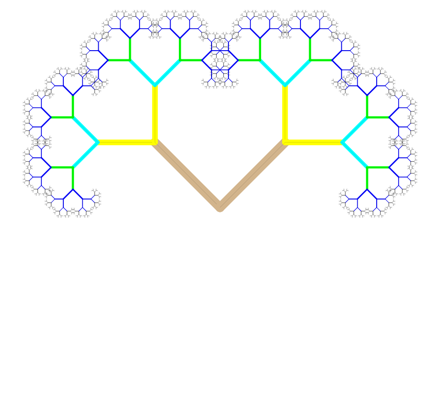

<h1>More into color</h1>

RGB (Red Green Blue) color

<blockquote>
  
SETPENCOLOR (LIST 100 0 0)
  SETPENCOLOR (LIST 0 100 0)
  SETPENCOLOR (LIST 0 0 100)

</blockquote>

<a href="http://media.learnstones.com/jslogo/?to%20artery%20:size%20cs%20repeat%20330%20[setpensize%20(0%20+%20repcount/3)%20label%20repcount%20rt%20:size%20SETPENCOLOR%20(LIST%200%20(60%20+%20RANDOM%2040)%200)%20fd%2010%20]%20end%20make%20%22size%200.15%20+%20(random%20100)/100%20print%20list%20%22size%20:size%20artery%20:size">Green Artery</a>

<h1>Shades of Red</h1>

<blockquote>
  
setpensize 200 
  SETPENCOLOR  (LIST (60 + RANDOM 20) 0 0)
  FD 100

</blockquote>

<h1>Using Repcount</h1>

When you are repeating

<pre><code>cs
bk 50
setlabelheight 20
setpensize 1
repeat 20 [setpencolor 2 fd 200 rt 88 setpencolor 1 label repcount]
</code></pre>

Or

<pre><code>cs
pu setx -100 pd
repeat 15 [
setpensize repcount *3
setpencolor repcount 
fd 100 bk 100
pu rt 90 fd repcount*3 lt 90 pd
]
</code></pre>

<h1>Playing with words</h1>

<blockquote><code>
    make "noun [brick fire flame water]
    make "verb [burn flow jump]
    make "adj [bright dangerous]

    print (list "the pick :noun (word pick :verb "s)  (word pick :adj "ly))
</code></blockquote>

Or add the following print line instead

<blockquote><code>
    print ( sentence 
    [once upon a time there was a] 
    pick :noun 
    [that] 
    (word pick :verb "ed) 
    [so] 
     (word pick :adj "ly)
    [that I didnt know what todo]
    )
</code></blockquote>

<h1>Recursion: Binary Tree</h1>

Imagine a program that creates itself. Viruses do that and they can get out of control. Programs that create themselves can also crash the computer, so its important that we know how control them.

Try the following code where :s is the size:

<pre><code>to branch :s
  lt 45 fd :s bk :s rt 45
  rt 45 fd :s bk :s lt 45
end

branch 190
</code></pre>

Firstly, to keep branch under control add the following as the first statement of branch.

<pre><code>if :s &lt;5 [Stop]   
</code></pre>

then after the turtle has gone forward to the end of the branch ask it to do another branch of half the size

<pre><code>branch :s  * 0.5
</code></pre>

If you miss the reduction in size the program will never stop... and it could get messy.

<a href="http://studio.code.org/c/34062557">See the tree being draw</a> in Blockly

<h2>What next?</h2>

<ul>
<li>increase the size multiple eg. 0.6</li>
<li>change the angle of the branch</li>
<li>change stopping condition</li>
<li>add a branch width</li>
</ul>

