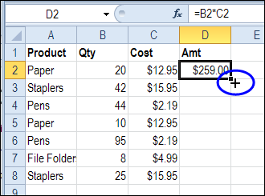
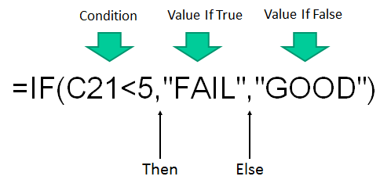
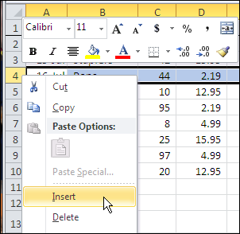
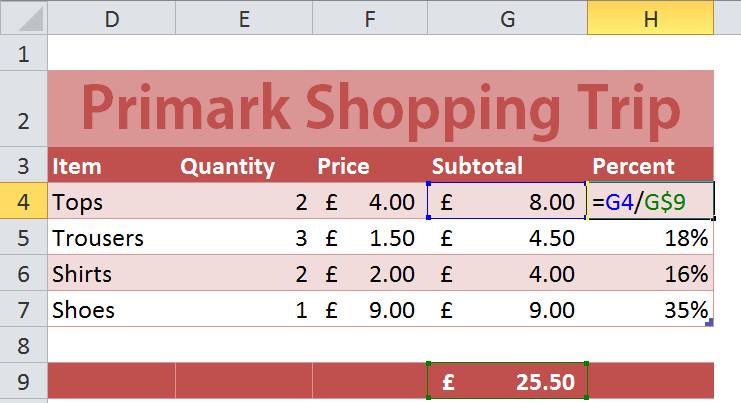

Sum
===

    =A1+A2+A3+A4+A5+A6+A8+A9+A10
    =sum(A1:A10)

- What is the difference between the 2 formula?
- Which is better?
- Why?

------------------------
Self Marking Spreadsheet
========================

Practical uses of Excel and using speed techniques such as copy down.
[Self Marking Spreadsheet Task](http://learnstones.com/media/dra/ict/ecdl-extra/excel/self_marking_spreadsheet_exercises.xls)

------------
Copy Down
============

On the corner the white cross to change to a black cross

Then pull the formula down

--------------
Function Magic Task
==============

Practice more functions (Average, Min, Max, Count)
[Function Magic Spreadsheet Task](http://learnstones.com/media/dra/ict/ecdl-extra/excel/function-magic-v01.xlsm)

----------
If Function
===========
Change a cell's contents depending on a certain condition

    
[More Detailed Explanation](http://www.techonthenet.com/excel/formulas/if.php)

----------
Insert Row
==========

 

or right click the row number (4) 

[Youtube Video Help](http://www.youtube.com/watch?feature=player_detailpage&v=8NyHw561Qv8) Second half shows how to insert multiple rows

----
Absolute References
========
   
    $ (the dollar sign) anchors the following character ...
	so it doesn't change when you copy down.

### Extra Task - Brain Teaser
Create a single formula to calculate all the times tables

[Answer](http://excelsemipro.com/wp-content/uploads/2010/10/Absolute-Relative-Formulas.png)  But don't cheat yourself. Why not try solving it with a class mate first.

### See Also
Geek Link [Interesting Resource](http://blogs.msdn.com/b/microsoft_press/archive/2011/12/23/new-book-microsoft-excel-2010-formulas-amp-functions-inside-out.aspx)

-----------
Range Names
===========
- Can make it easier to understand formula
- are an alternative to absolute references

### How to create range names
[Google: Excel Range Names](https://www.google.co.uk/search?q=excel+range+names)  (... [About.com](http://spreadsheets.about.com/od/r/g/absolute_cell_r.htm) is recommended)