Why Vex IQ?
===========
This is a beginners tutorial to robotics based around Vex IQ, but most of the tasks can be done with more simple robots. Vex IQ is certainly THE premium robotics platform. And, at a price of $500 US ($700 BND) its around 10 times more expensive than the cheapest robot solutions. Why?:

1. Smart Motors: These motors can measure how far they have turned and allow you to choose the distance to travel or the angle of turn. They are powerful - the large battery helps as do the grippy tires - and perform well on most surfaces
2. Gyro: This sensor allows you to make even more accurate turns and correct for any wheel spin
3. Build: Engineering Lego style kits are available to create custom grabbers and lifters that are needed for robotics competitions

Like most robots Vex IQ has a standard distance sensor and light sensor used for line following but these sensor are rather unremarkable.

Getting Started
===============

----------
Sensor Bed
==========
[add input process output diagram]

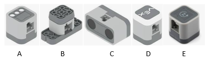
Its VITAL that you are able to recognise and name the 5 sensors - and the actuators (not shown)

Do NOT take apart a working robot to make the sensor bed (see below). Not unless you have a couple of hours to put it back together. ([note: build instructions are here](https://education.vex.com/xyleme_content/testbed-iq-sensors/pdf/testbed-iq-sensors.pdf))

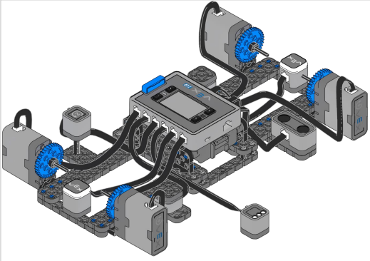

Your teacher may have a ready made sensor bed system for you to try, . The advantages of the sensor bed are:

1. You get a DECOMPOSED robot, you can see each sensor
2. The mysterious 'robot' is just a collection of sensors (inputs) and actuators (outputs)
3. Its easy to learn which blocks are used with which sensor or actuator
4. You can see each wire and the port it attaches to so you can learn how to solve missing sensor errors 

That said, you can do the activities from page 15 in the pdf (linked above) using a standard build Vex IQ robot. Its just a little more difficult to see where the wires go and to decompose each part of the robot.

The quiz at the end of the pdf has been made into a [Google Forms Quiz here](https://forms.gle/VedkhPSbqhexbpX38)

--------------
Basic Movement
=============
With Smart motors you can precisely move forward/backwards and turn a certain number of degrees

Task 1 : Forward Backwards
------
This is a simple 'Hello World' style task to make sure you know how to connect to the robot, install the drivetrain device and find and run the following SEQUENCE of blocks.

    Drive forward 20 cm (200mm)
    Wait 1 second
    Drive backwards 20 cm (200mm)

If its not working check: 
- is Battery inserted? 
- is the USB connecting green light on? 
- are drivers are up to date?

We are now going to look at more complex turning

Task 2 : Square and Polygons
------

These are [Logo Turtle](https://www.google.co.uk/search?hl=en&q=Logo+Turtle) style problems. Which is great because the turtle was modelled on a 2 wheel robot with a tail skid. And that's how Vex IQ behaves (despite having 4 wheels - they all have to skid to make turns)

    Drive a square 1 m in size (1000 mm)
      then
    Dive a triangle, pentagon and hexagon

Task 3 : Navigate A to B
------
You can practice this exercise using Vex VR in the Wall Maze playground. You can set A to B's for your friends to solve.

    Place the robot near A (see photo)
    Start sequence of moves and turns [use the touch LED - optional]
    Finish with at least one wheel on the paper at B

For Non Vex IQ robots
==============================

Microbit: Gigglebot
--------
Less advanced robots don't have Motor Encoders (aka Smart Motors - see the next Learnstone) you will have to adjust the time to achieve your desired distance
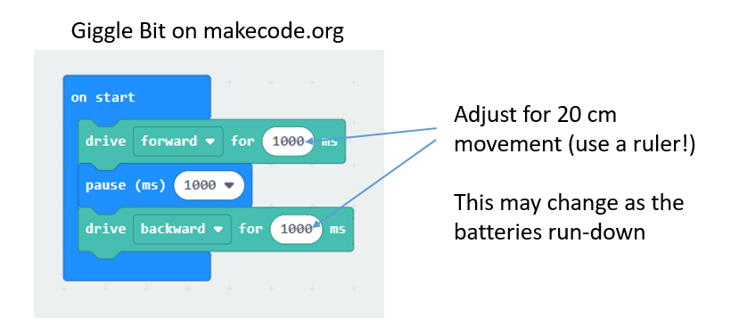

Microbit: Qdee
--------
https://github.com/Hiwonder/Qdee <-This is the library that you must copy and paste into the extensions window
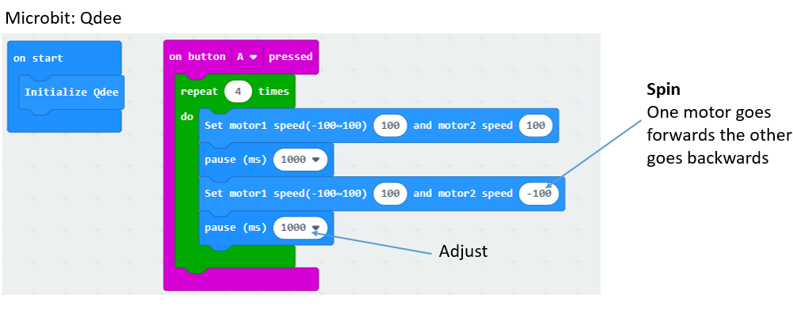

----------------------------
Smart Motors vs. Dumb Motors
============================

If you are impatient to do more you could skip this part. But this page is good to learn why Vex IQ is so much more better than other robots. If you can get hold of another robot to compare then that would be great. Otherwise you could use the 'Dumb Blocks' and avoid the Smart features of the VEX motors.

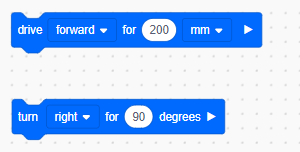

These seemingly innocent blocks are missing from more simple robots like Gigglebot or Qdee. They need motor encoders to function.

What are Motor Encoders?
------------------------

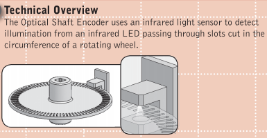

As the shaft turns the light shining through the ....

[External Shaft Encoders](https://content.vexrobotics.com/docs/instructions/276-2156-instr-0312.pdf) are used on the older Vex EDR platform

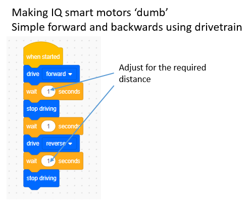

If you want to try and avoid the motor encoders for turning you have to install independent motors (not drivetrain).
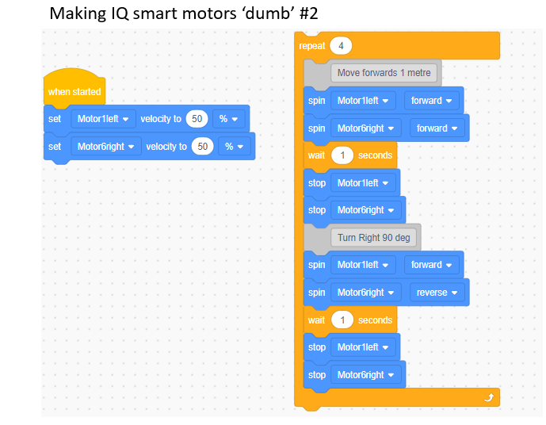

----
Gyro
====

To use the gyro replace the turn left 90 block with turn to heading 90. Its a good idea to reset the Gyro using the 'set drive heading to 0' block at the beginning of your code (Be careful not to keep resetting it in the loop)
 
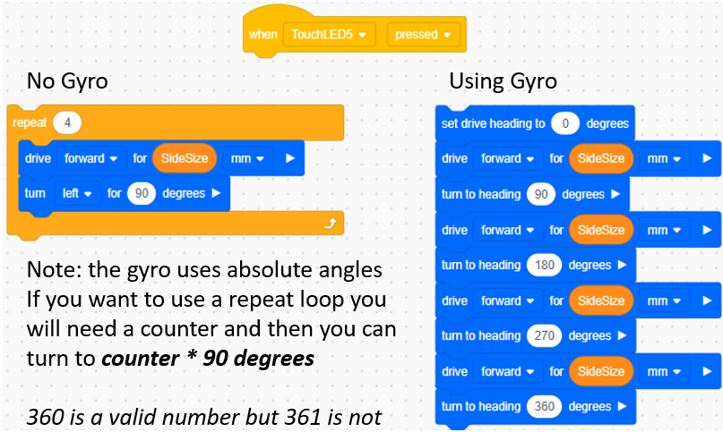

Don't get confused
-----------------

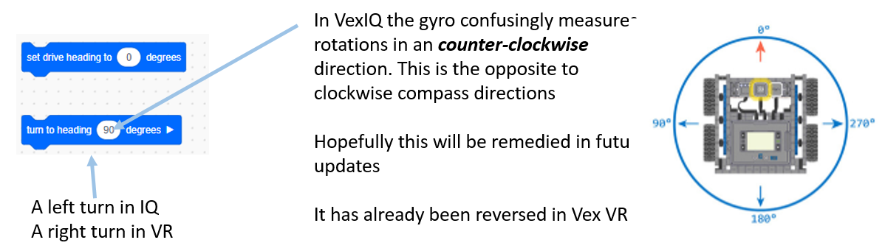
[link to [youtube video Gyro Experiment](https://youtu.be/xTq2nWdhJZw)]

Using Gyro on rough terrain
---------------------------
On rough ground you need to constantly correct the heading. This can be done in the following way
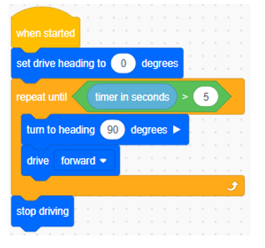

The difference between heading and rotation
-----------------
The best way of understanding this is to use the following code making sure you rotate left first.

0. gyro heading vs rotation

-------------
Feedback & UI
=============

Input Buttons

- Touch LED
- Bump Sensor
- Brain Buttons

Output

- Sound
- Lights (Touch LED)
- Brain Screen

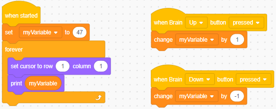

If you want to use more lines of the brain 
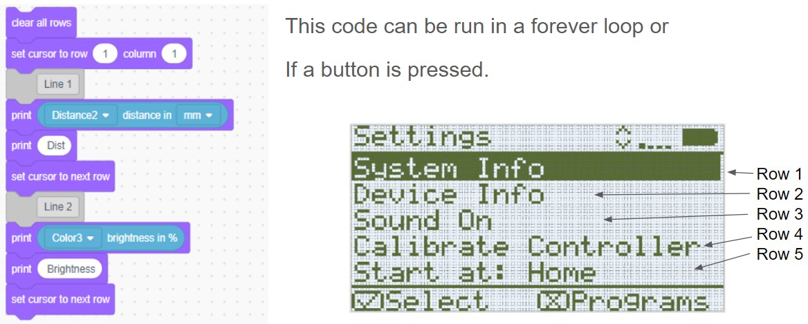

---------------
Distance Sensor
===============
The bump sensor is a special kind of distance sensor (see below)

Bumper Sensor
===========
This sensor is a simple switch that either registers that the robot is hitting something or not (ie. it returns a boolean value 1,0 or on/off)

Bumper sensors can be useful for stopping or starting a robot or can form part of the User Interface (see stone 6).

--------------
Wall Following
============== 

------
Curves
======

---------------------
Colour (& Light) Sensor and Thresholds
=====================

--------------
Line Following
==============

---
Arm & Grabbers
===

---
Controller / Remote
====

-------------
Task Lists
=============

To Do
-------
- link scoreboard
- compile teachers solutions ppt and .iqblocks
- add links to sensor info
- reduce font?

Tasks Lists
-----------
Smart Motors / 'Dumb' Motors / Gyro / Rough Terrain?
1. Forwards Backwards  [Vex VR](https://vr.vex.com/) Disk Mover Playground
2. Square + Other Polygons
3. Navigate A to B (Smart, Dumb, Gyro, With Sensors) [Vex VR](https://vr.vex.com/) Wall Maze Playground

Distance Sensor
4. Obstacle Avoider
5. Round the wall/box (1 block, 1-3 blocks, 1-3 and back to original path)
6. Follow My Leader (FD,BK ; FD,BK & RT ; FD, BK & RT or LT)
7. Wall Following (for most able)
8. Closest Block (scan 180 minimum) for Castle Crash

Bump Sensor
9. Wall Slam

Curves
10. Different Radii (with slots or UI)
11. S & 8

Colour / Light Sensor
12. Threshold finder (black & white, Tape & mottled surface, only hue or only brightness)
13. Line following (1 sensor is available in examples, 2 sensor)
14. Stay in the square (depends on surfaces)

Light + Distance Sensor 
15. Castle Crash (simple scan, minimum in 180 scan) [Vex VR](https://vr.vex.com/) Castle Crash Playground

Arms & Grabbers
16. Sorting coloured blocks with Clawbot

Computer Science 
----------------
1. Sequence: Many
2. Selection: Many
3. Iteration: 
- Repeat: T2 Polygon
- While: T3 Round the wall/box
4. Minimums or Maximums T10 Castle Crash

Computational Thinking
----------------------
1. Decomposition: of the robot into sensors and actuators. Input-Process-Output model
2. Pattern Recognition
3. Abstraction
4. Algorithm Design: All tasks
5. Debugging & Testing All tasks. Ask for 
a. A diagram
b. Some Psuedocode
c. A discussion of what went wrong